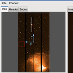
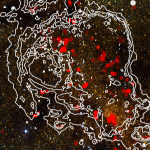

:orphan:

Packages affiliated with the Astropy project
============================================

A major part of the Astropy project is the existence of "Affiliated
Packages". An affiliated package is an astronomy-related python package
that is not part of the `astropy` core source code, but has requested to
be included in the Astropy project. The projects are expressing an
interest in Astropy's goals of improving reuse, interoperability, and
interface standards for python astronomy and astrophysics packages.

If you are the developer of an astronomy package, and would like to become
affiliated with the Astropy project, please drop us a line on the astropy-dev
mailing list!

Python-montage
--------------

.. |mont| image:: montage.png
.. _Montage Documentation: http://montage-wrapper.readthedocs.org/en/latest/
.. _Montage Installation: http://montage-wrapper.readthedocs.org/en/latest/#installation

+--------+-------------------------------------------------------------------+
| |mont| | **About:** Montage-wrapper is a pure Python module that provides a|
|        | Python API to the Montage Astronomical Image Mosaic Engine,       |
|        | including both functions to access individual Montage commands,   |
|        | and high-level functions to facilitate mosaicking and             |
|        | re-projecting. Python-montage uses the Astropy core package for   |
|        | reading and writing FITS files.                                   |
|        |                                                                   |
|        | **Developer:** Thomas Robitaille                                  |
|        |                                                                   |
|        | `Montage Documentation`_ - `Montage Installation`_                |
|        |                                                                   |
+--------+-------------------------------------------------------------------+

Ginga
-----

.. _Ginga Home and Installation: http://ejeschke.github.io/ginga/

+--------+-------------------------------------------------------------------+
||ginga| | **About:** Ginga is a viewer for astronomical data FITS (Flexible |
|        | Image Transport System) files. The Ginga viewer centers around a  |
|        | new FITS display widget which supports zooming and panning, color |
|        | and intensity mapping, a choice of several automatic cut levels   |
|        | algorithms and canvases for plotting scalable geometric forms.    |
|        |                                                                   |
|        | **Developer:** Eric Jeschkee                                      |
|        |                                                                   |
|        | `Ginga Home and Installation`_                                    |
|        |                                                                   |
+--------+-------------------------------------------------------------------+

APLpy
-----

.. _APLpy Home: http://aplpy.github.io
.. _APLpy Documentation: http://aplpy.readthedocs.org
.. _APLpy Installation: http://aplpy.github.io/install.html

+--------+-------------------------------------------------------------------+
||aplpy| | **About:** APLpy (the Astronomical Plotting Library in Python) is |
|        | a Python module aimed at producing publication-quality plots of   |
|        | astronomical imaging data in FITS format. The module uses         |
|        | Matplotlib, a powerful and interactive plotting package. It is    |
|        | capable of creating output files in several graphical formats,    |
|        | including EPS, PDF, PS, PNG, and SVG.                             |
|        |                                                                   |
|        | **Developers:** Thomas Robitaille, Eli Bressert, Adam Ginsburg    |
|        |                                                                   |
|        | `APLpy Home`_ - `APLpy Documentation`_ - `APLpy Installation`_    |
|        |                                                                   |
+--------+-------------------------------------------------------------------+

In development
--------------

A few additional affiliated packages are currently in development, including:

* `photutils <http://photutils.readthedocs.org/en/latest/>`_: photometry tools
* `astroquery <http://astroquery.readthedocs.org/en/latest/>`_: online database querying
* `specutils <https://github.com/astropy/specutils>`_: spectroscopic analysis utilities
* `kcorrect <https://github.com/astropy/kcorrect>`_: Python bindings to kcorrect code of Blanton et al. 2007

These packages are still very much in development, and the user interface (API) may not be stable. If you do try these packages, please do report any issues to the developers, so 

Registry
--------

To see the full list of registered affiliated packags, or for information on
registering your package, see the :ref:`registry`.
